# 🎮 Guía de Setup para el Servidor de Minecraft

## 📋 Requisitos previos

- **Launcher de Minecraft** instalado (versión 26.2)
- **Fabric Loader** 0.19.3
- **Mods del servidor** (se descargan con una de las opciones de abajo)

---

## Paso 1: Instalar Minecraft 26.2

1. Abre el **Minecraft Launcher**.
2. Crea o abre una **instalación (instance)** nueva.
3. Selecciona la **versión 26.2** de Minecraft.

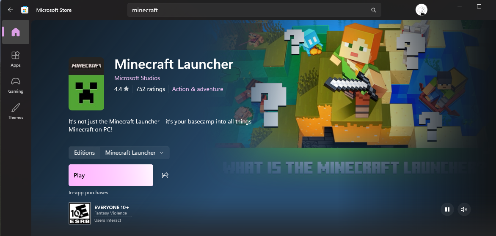

---

## Paso 2: Instalar Fabric Loader

1. Ve a **[fabricmc.net/use/installer/](https://fabricmc.net/use/installer/)**.
2. Descarga el **Fabric Installer**.
3. Ejecuta el instalador:
   Puedes dejar todo por defecto como esta o verificar si cumple con lo siguiente:
   - Selecciona tu carpeta de instalación de Minecraft (usualmente `~/.minecraft` o `%appdata%/.minecraft`).
   - Asegúrate de que la versión seleccionada sea **Minecraft 26.2**.
   - Elige **Client** como tipo de instalación.
   - Presiona **Install**.

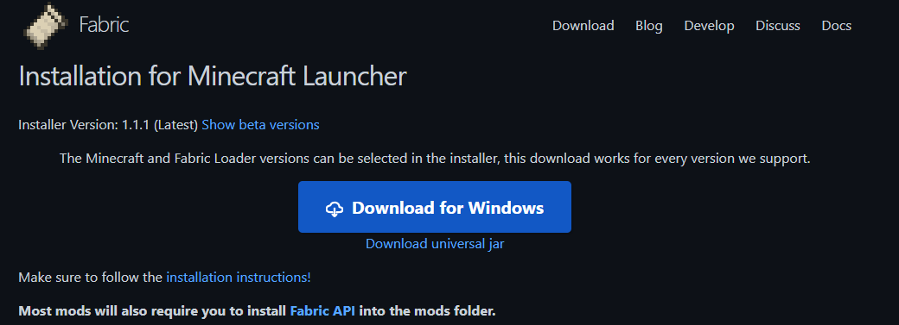

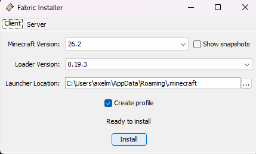

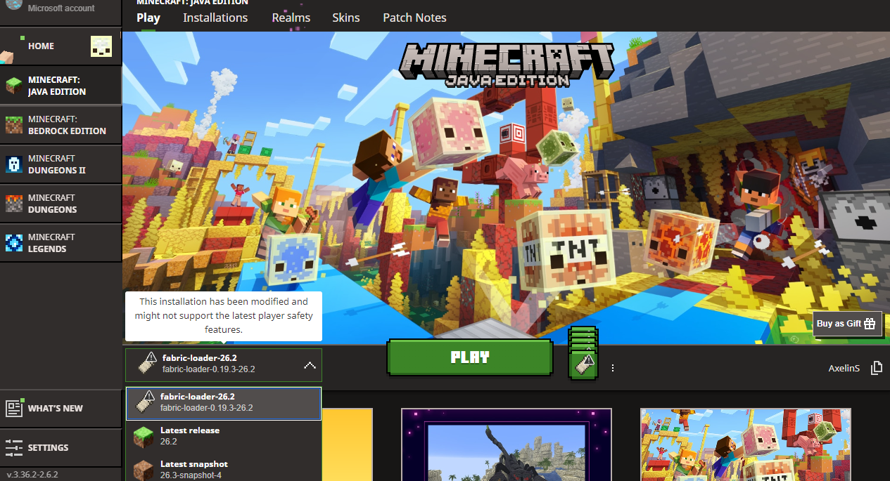

---

## Paso 3: Instalar los Mods del Servidor

Elige **una** de las siguientes opciones:

---

### Opción A: Usar Modpack Updater *Windows (Recomendado) 🔄

> ⚠️ **Nota sobre Windows Defender:** El programa es 100% **código abierto y seguro**. Windows Defender puede lanzar una alerta falsa. Si esto ocurre:
> 1. Haz clic en **"Más información"**.
> 2. Presiona **"Ejecutar de todos modos"**.

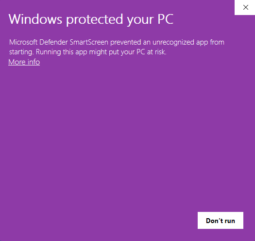

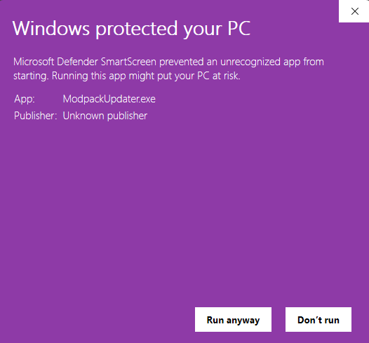

1. Descarga **Modpack Updater** desde [este enlace (Google Drive)](https://drive.google.com/file/d/1LAe5gxguPj8RRNGODmgUaQGR-Q70qecs/view?usp=sharing) o compila su codigo de [GitHub](https://github.com/AxelinS/modpackUpdater).
2. Ejecuta el programa.
3. El programa debería **detectar automáticamente** tu carpeta `.minecraft` si la instalaste en su ubicación por defecto. Si no, selecciónala manualmente.
4. Presiona el botón **"Buscar Actualizaciones"**.
5. El programa descargará/actualizará todos los mods automáticamente.

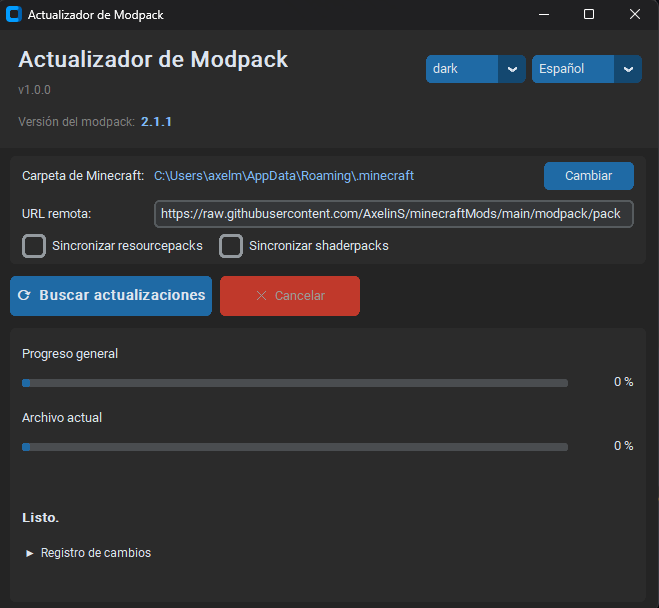

> ⚠️ **Ten en cuenta:** Modpack Updater puede **borrar mods** que agregues manualmente. Solo usa mods oficiales del pack.

**Versión actual del modpack: `26.2.0`**

---

### Opción B: Descargar la carpeta de mods desde Google Drive 📦

1. Descarga el pack de mods desde [este enlace (Google Drive)](https://drive.google.com/file/d/1bYzbY2v77YSA-hhwiMlgocg7ZYbhS_YW/view?usp=drive_link).
2. **Extrae el archivo `.zip`**.

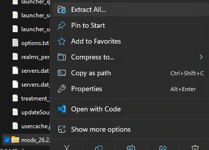

3. Abre tu carpeta `.minecraft`:
   - **Windows:** Presiona `Win + R`, escribe `%appdata%/.minecraft` y presiona Enter.
   - **Mac:** `~/Library/Application Support/minecraft/`
   - **Linux:** `~/.minecraft/`
4. Copia la carpeta `mods` dentro de `.minecraft` (si la carpeta `mods` no existe, créala).

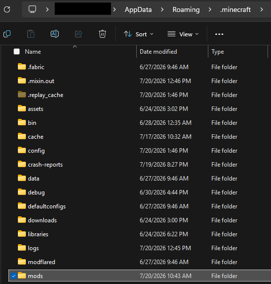

---

## Paso 4: Entrar al Servidor

1. Abre el **Minecraft Launcher** y selecciona la instalación de **Fabric 26.2**.
2. Presiona **Jugar** para entrar al juego.

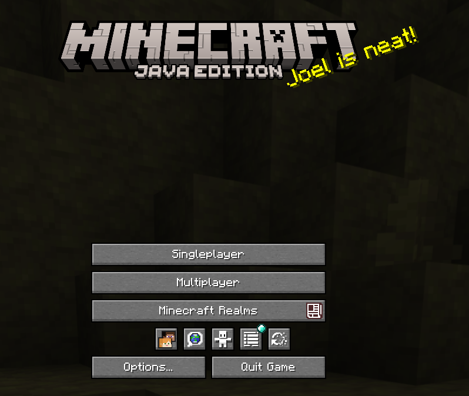

3. En el menú principal, presiona **"Multijugador"** → **"Agregar servidor"**.

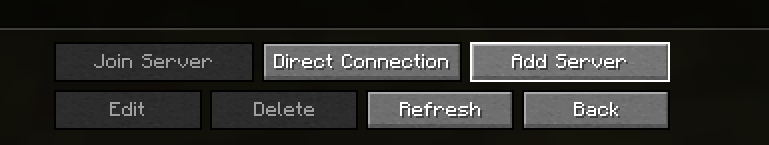

4. En la pantalla de **"Agregar servidor"**, completa los datos:

| Campo        | Valor                      |
|-------------|----------------------------|
| Nombre      | (el que quieras, ej: "Mi Servidor") |
| IP/Address  | `mainkra.axelins.cc`      |

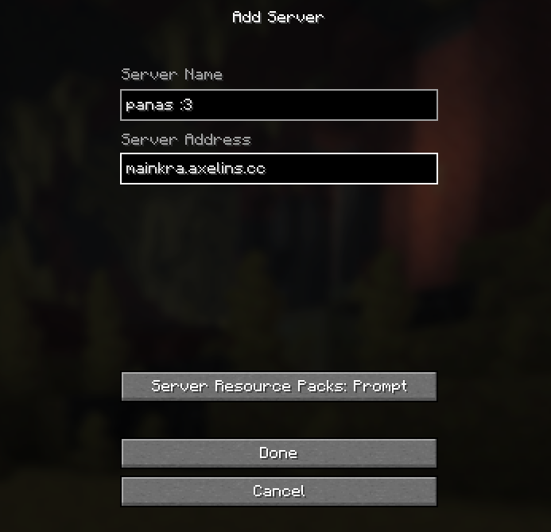

5. Presiona **"Listo"** y luego **"Entrar al servidor"**.

---

## ℹ️ Información del Server

| Campo       | Valor                     |
|------------|---------------------------|
| Versión    | Minecraft 26.2            |
| Loader     | Fabric 0.19.3             |
| Modpack    | 26.2.0                    |
| IP         | `mainkra.axelins.cc`     |

---

*¡Nos vemos dentro!* 🧱✨
